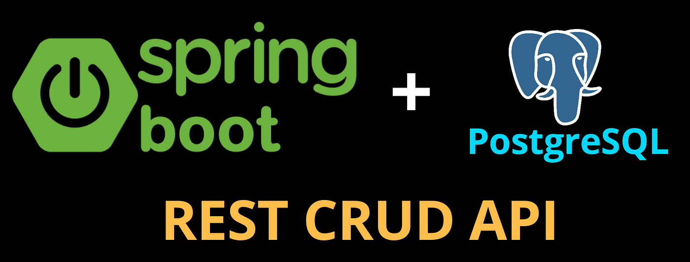
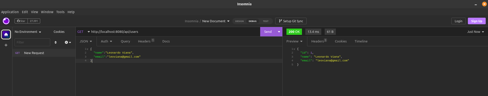
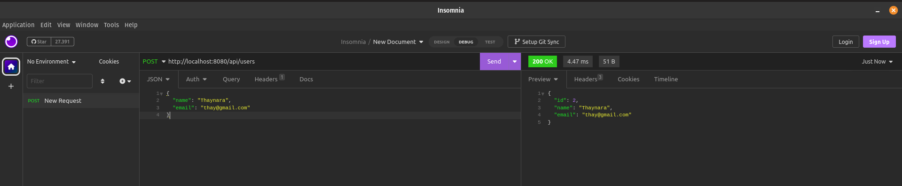
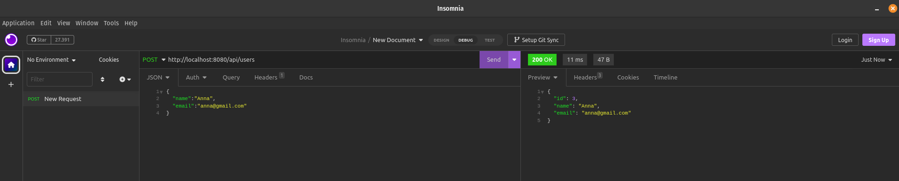
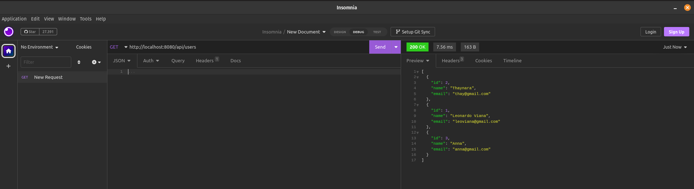
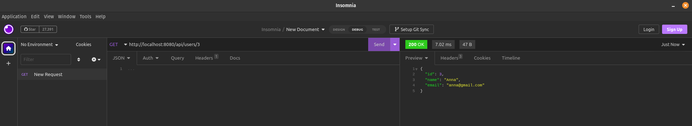
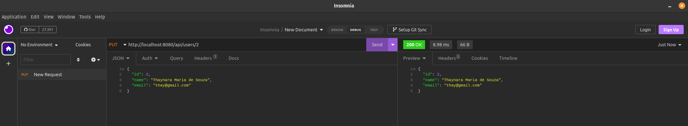
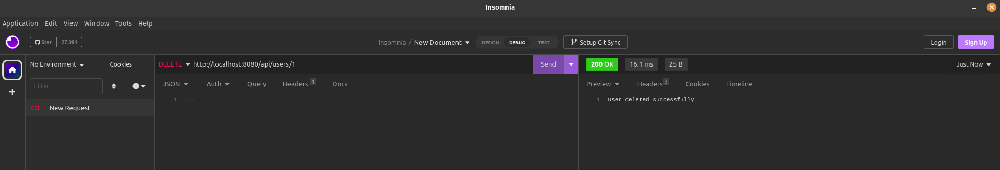

<h1 align="center">CRUD com Springboot e Postgresql </h1>

<p align="center">
  
  
</p>

<p align="center">
  <a href="#-projeto">Projeto</a>&nbsp;&nbsp;&nbsp;|&nbsp;&nbsp;&nbsp;
  <a href="#-tecnologias">Tecnologias</a>&nbsp;&nbsp;&nbsp;|&nbsp;&nbsp;&nbsp;
  <a href="#-etapas">Etapas</a>&nbsp;&nbsp;&nbsp;|&nbsp;&nbsp;&nbsp;
  <a href="#-requisitos">Requisitos</a>&nbsp;&nbsp;&nbsp;|&nbsp;&nbsp;&nbsp;
  <a href="#-licença">Licença</a>&nbsp;&nbsp;&nbsp;|&nbsp;&nbsp;&nbsp;
  <a href="#-referências">Referências</a>
</p>

<p align="center">
  
</p>

## 🌱 Projeto

- Criação de uma API CRUD Rest em Java:
- Criar 5 endpoints para operações CRUD básicas:
    - Create
    - Read all
    - Read one
    - Update
    - Delete

## ✨ Tecnologias

- Spring Boot (Framework to build web servers in Java)
- Hibernate (Java ORM)
- Postgres (relational database)
- Docker (for containerization)
- Docker Compose

## 🚀 Etapas

- [x] Crie um aplicativo Java usando Spring Boot, Spring Web, Spring Data e Hibernate.
- [x] Execute o banco de dados Postgres em um contêiner usando o Docker Compose e teste-o com o TablePlus.
- [x] Dockerize o aplicativo Java escrevendo um Dockerfile e um arquivo docker-compose.yml para executar o aplicativo e o banco de dados.
- [x] Crie o aplicativo Java, crie a imagem do Docker e execute o contêiner usando o Docker Compose e teste-o com o Insomnia.

## 🗒 Requisitos

- Java instalado
- Maven (ou qualquer outra ferramenta de compilação para Java)
- Qualquer IDE Java
- Docker instalado e em execução
- (Opcional): Insomnia e Tableplus para acompanhar, mas qualquer ferramenta de teste funcionará
- (Opcional):Extensões para o Vscode:
    - Extension Pack for Java
    - Spring Initializr Java Support

## Criando o Projeto

- Spring Boot
- Maven project 
- Spring Boot version 3.0.5 
- Escolha a package. Meu caso: io.viana
- Artifact Id
- Tipo do pacote: Jar 
- Java version: 17
- Spring Web (Para lidar com solicitações HTTP)
- Spring Data JPA (Para manipular o banco de dados)
- PostgreSQL Driver

## 🚀 Execução

- Criando o arquivo .jar

```bash
mvn clean package -DskipTests
```

- Rodando o docker compose

```bash
docker compose up --build
```

## 📝 Testando o aplicativo

- Requisição `GET` para localhost:8080/api/users
- Deve retornar um array vazio

<p align="center">
  
</p>

## 📝 Crie um usuário

- Fazer uma requisição `POST` para localhost:8080/api/users

- Criar usuário 1.

<p align="center">
  
</p>

- Criar usuário 2.

<p align="center">
  
</p>

- Criar usuário 3.

<p align="center">
  
</p>

## 📝 Obtenha todos os usuários

- Pegar todos os usuários fazendo uma requisição `GET` para localhost:8080/api/users

<p align="center">
  
</p>

## 📝 Obtenha um usuário

- Obtendo um usuário específico, solicitação `GET` para localhost:8080/api/user/3

<p align="center">
  
</p>

## 📝 Atualize um usuário

- Atualizando um item em específico, solicitação `PUT` localhost:8080/api/users/2 fornecendo um novo corpo

<p align="center">
  
</p>

## 📝 Excluir um usuário

- Excluindo o usuário 1, solicitação `DELETE` para localhost:8080/api/users/1

<p align="center">
  
</p>


## 📄 Licença


## 🙇 Referências

- [TABLEPLUS](https://tableplus.com/blog/2019/10/tableplus-linux-installation.html)
- [INSOMNIA](https://insomnia.rest/download)